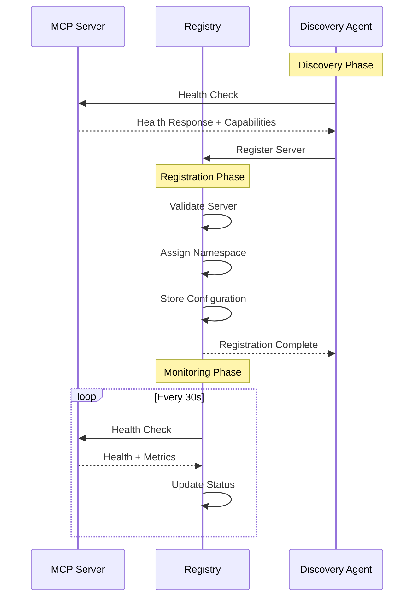

# MCP Server Registry Architecture

**Author**: Lance James, Unit 221B, Inc  
**Date**: August 24, 2025  
**Version**: 1.0  

## Overview

The **MCP Server Registry** is a centralized multi-server SSE aggregator that provides unified access to multiple MCP servers through a single endpoint. It manages server discovery, tool namespace collision resolution, health monitoring, and authentication while providing real-time SSE streaming capabilities.

## Core Architecture

### 1. Service Components

```
┌─────────────────────────────────────────────────────────────┐
│                     CLIENT LAYER                            │
├─────────────────────────────────────────────────────────────┤
│ Claude Desktop │ Claude Code │ Custom MCP Clients           │
└─────────────────┬───────────────────────────────────────────┘
                  │ HTTP/SSE
┌─────────────────▼───────────────────────────────────────────┐
│                MCP REGISTRY GATEWAY                         │
├─────────────────────────────────────────────────────────────┤
│ • SSE Aggregator        • Authentication Manager            │
│ • Tool Namespace Router • Health Monitor                    │
│ • Request Multiplexer   • Load Balancer                     │
└─────────────────┬───────────────────────────────────────────┘
                  │ Internal Registry Protocol
┌─────────────────▼───────────────────────────────────────────┐
│                 SERVER REGISTRY                             │
├─────────────────────────────────────────────────────────────┤
│ • Service Discovery     • Configuration Management          │
│ • Health Tracking       • Capability Registry               │
│ • Load Metrics         • Access Control                     │
└─────────────────┬───────────────────────────────────────────┘
                  │ Discovery & Management
┌─────────────────▼───────────────────────────────────────────┐
│                 MCP SERVER POOL                             │
├─────────────────────────────────────────────────────────────┤
│ Memory Server │ File Server │ Web Server │ Custom Servers   │
│ Port: 8900   │ Port: 8900  │ Port: 8902 │ Port: 89XX       │
└─────────────────────────────────────────────────────────────┘
```

### 2. Component Responsibilities

#### MCP Registry Gateway (Main Service)
- **Port**: 8890 (Registry Gateway)
- **Transport**: HTTP + SSE
- **Functions**:
  - Aggregate SSE streams from multiple MCP servers
  - Route requests to appropriate servers based on tool names
  - Handle authentication and authorization
  - Provide unified tool listing and capabilities
  - Load balance requests across server instances

#### Server Registry (Internal Service)
- **Storage**: Redis + SQLite hybrid
- **Functions**:
  - Track server registration and health
  - Manage tool namespace mappings
  - Store server configurations and capabilities  
  - Handle server discovery and auto-registration
  - Maintain access control policies

#### MCP Server Pool (Managed Servers)
- **Transport**: HTTP, SSE, or stdio
- **Management**: Auto-discovery and registration
- **Functions**:
  - Provide specialized MCP tools and resources
  - Report health and capabilities to registry
  - Handle tool execution requests
  - Maintain independent configuration

## 2. Tool Namespace Management Strategy

### Namespace Prefixing System

```typescript
interface ToolNamespace {
  server_id: string;          // e.g., "memory-server"  
  server_name: string;        // e.g., "hAIveMind Memory"
  tool_prefix: string;        // e.g., "memory__"
  original_tools: string[];   // e.g., ["store_memory", "search_memories"]
  namespaced_tools: string[]; // e.g., ["memory__store_memory", "memory__search_memories"]
  priority: number;           // Tool resolution priority (1-10)
  aliases: string[];          // Alternative prefixes ["mcp__memory__", "hv__"]
}
```

### Prefix Assignment Rules

1. **Automatic Prefixing**: All tools from server `server-name` get prefix `servername__`
2. **Conflict Resolution**: If multiple servers have same tool name:
   - Higher priority server gets unprefixed name
   - Lower priority servers get mandatory prefixes
3. **Alias Support**: Popular servers can have shorter aliases (`hv__` for hAIveMind)
4. **Legacy Support**: Tools without conflicts can remain unprefixed

### Example Tool Resolution

```json
{
  "available_tools": [
    {
      "name": "store_memory",
      "server": "memory-server",
      "description": "Store memory in hAIveMind collective",
      "canonical_name": "memory__store_memory",
      "aliases": ["hv__store_memory", "mcp__memory__store_memory"]
    },
    {
      "name": "read_file", 
      "server": "file-server",
      "description": "Read file contents",
      "canonical_name": "file__read_file",
      "conflicts": ["web__read_file"]
    }
  ]
}
```

## 3. Server Discovery and Registration Protocol

### Discovery Methods

#### 1. Static Configuration Discovery
```json
{
  "static_servers": [
    {
      "id": "memory-server",
      "name": "hAIveMind Memory",
      "endpoint": "http://localhost:8900/sse",
      "transport": "sse",
      "priority": 10,
      "auto_start": true,
      "health_check": "http://localhost:8900/health"
    }
  ]
}
```

#### 2. Network Discovery (Tailscale/mDNS)
```json
{
  "discovery": {
    "tailscale_enabled": true,
    "mdns_enabled": true,
    "network_scan": "10.0.0.0/8",
    "discovery_ports": [8900, 8902, 8903, 8904, 8905],
    "discovery_interval": 60
  }
}
```

#### 3. Dynamic Registration API
```http
POST /registry/api/servers
Content-Type: application/json
Authorization: Bearer <server-token>

{
  "server_id": "custom-server",
  "name": "Custom MCP Server", 
  "endpoint": "http://custom-host:8905/sse",
  "transport": "sse",
  "capabilities": {
    "tools": ["custom_tool", "another_tool"],
    "resources": ["custom://resource"],
    "prompts": ["custom-prompt"]
  },
  "health_endpoint": "http://custom-host:8905/health",
  "metadata": {
    "version": "1.0.0",
    "description": "Custom server for specific tasks"
  }
}
```

### Registration Workflow



## 4. Health Monitoring Approach

### Health Check System

#### Multi-Level Health Monitoring

```typescript
interface ServerHealth {
  server_id: string;
  status: 'healthy' | 'degraded' | 'unhealthy' | 'unreachable';
  last_check: string;
  response_time: number;
  error_rate: number;
  capabilities: {
    tools: number;
    resources: number; 
    prompts: number;
  };
  metrics: {
    requests_per_minute: number;
    success_rate: number;
    average_response_time: number;
  };
  incidents: HealthIncident[];
}

interface HealthIncident {
  timestamp: string;
  type: 'timeout' | 'error' | 'unavailable';
  message: string;
  duration: number;
}
```

#### Health Check Types

1. **Basic Health** (`/health` endpoint):
   ```json
   {
     "status": "healthy",
     "timestamp": "2025-08-24T10:30:00Z",
     "server_info": {
       "name": "memory-server",
       "version": "1.0.0"
     }
   }
   ```

2. **Capabilities Check** (`/capabilities` endpoint):
   ```json
   {
     "tools": ["store_memory", "search_memories"],
     "resources": ["memory://recent", "memory://stats"],
     "prompts": ["analyze-memory"]
   }
   ```

3. **Performance Check** (measure tool execution time):
   ```json
   {
     "test_tool": "ping",
     "response_time": 45,
     "success": true
   }
   ```

### Failure Handling

```yaml
health_policies:
  check_interval: 30s
  timeout: 10s
  failure_threshold: 3
  recovery_threshold: 2
  
  actions:
    degraded:
      - reduce_traffic: 50%
      - log_warning: true
    unhealthy:  
      - stop_routing: true
      - notify_admin: true
      - attempt_restart: true
    unreachable:
      - remove_from_pool: true
      - alert_critical: true
```

## 5. Authentication and Access Control Model

### Multi-Tier Authentication

#### 1. Registry-Level Auth (Outer Layer)
```json
{
  "registry_auth": {
    "enabled": true,
    "methods": ["jwt", "api_key", "oauth"],
    "jwt_secret": "${REGISTRY_JWT_SECRET}",
    "token_ttl": 3600,
    "refresh_enabled": true
  }
}
```

#### 2. Server-Level Auth (Inner Layer)  
```json
{
  "server_auth": {
    "propagate_user_context": true,
    "server_tokens": {
      "memory-server": "${MEMORY_SERVER_TOKEN}",
      "file-server": "${FILE_SERVER_TOKEN}"
    },
    "user_mapping": {
      "preserve_user_id": true,
      "add_registry_context": true
    }
  }
}
```

### Access Control Policies

```typescript
interface AccessPolicy {
  policy_id: string;
  name: string;
  rules: AccessRule[];
}

interface AccessRule {
  resource_type: 'server' | 'tool' | 'resource' | 'prompt';
  resource_pattern: string;  // e.g., "memory__*", "file__read_*"
  principals: string[];      // Users or roles
  actions: ('call' | 'list' | 'describe')[];
  conditions: {
    time_of_day?: string;
    ip_ranges?: string[];
    rate_limit?: number;
  };
}
```

### Example Policies

```json
{
  "policies": [
    {
      "policy_id": "admin-full-access",
      "name": "Administrator Full Access",
      "rules": [
        {
          "resource_type": "server",
          "resource_pattern": "*", 
          "principals": ["role:admin"],
          "actions": ["call", "list", "describe"],
          "conditions": {}
        }
      ]
    },
    {
      "policy_id": "user-memory-access",
      "name": "User Memory Operations",
      "rules": [
        {
          "resource_type": "tool",
          "resource_pattern": "memory__*",
          "principals": ["role:user"],
          "actions": ["call"],
          "conditions": {
            "rate_limit": 100
          }
        }
      ]
    },
    {
      "policy_id": "readonly-access", 
      "name": "Read-Only Access",
      "rules": [
        {
          "resource_type": "tool",
          "resource_pattern": "*search*",
          "principals": ["role:readonly"],
          "actions": ["call"],
          "conditions": {}
        }
      ]
    }
  ]
}
```

## 6. Database Schema for Server Registry

### SQLite Schema (Persistent Storage)

```sql
-- Server Registry Tables
CREATE TABLE servers (
    id TEXT PRIMARY KEY,
    name TEXT NOT NULL,
    endpoint TEXT NOT NULL,
    transport TEXT NOT NULL DEFAULT 'sse',
    status TEXT NOT NULL DEFAULT 'unknown',
    priority INTEGER NOT NULL DEFAULT 5,
    created_at INTEGER NOT NULL,
    updated_at INTEGER NOT NULL,
    config_json TEXT,
    metadata_json TEXT
);

CREATE TABLE server_capabilities (
    server_id TEXT NOT NULL,
    capability_type TEXT NOT NULL, -- 'tool', 'resource', 'prompt'
    name TEXT NOT NULL,
    original_name TEXT NOT NULL,
    namespace_prefix TEXT,
    description TEXT,
    parameters_json TEXT,
    created_at INTEGER NOT NULL,
    PRIMARY KEY (server_id, capability_type, name),
    FOREIGN KEY (server_id) REFERENCES servers(id) ON DELETE CASCADE
);

CREATE TABLE server_health (
    server_id TEXT NOT NULL,
    timestamp INTEGER NOT NULL,
    status TEXT NOT NULL,
    response_time INTEGER,
    error_message TEXT,
    metrics_json TEXT,
    PRIMARY KEY (server_id, timestamp),
    FOREIGN KEY (server_id) REFERENCES servers(id) ON DELETE CASCADE
);

CREATE TABLE access_policies (
    id TEXT PRIMARY KEY,
    name TEXT NOT NULL,
    rules_json TEXT NOT NULL,
    created_at INTEGER NOT NULL,
    updated_at INTEGER NOT NULL
);

CREATE TABLE user_sessions (
    session_id TEXT PRIMARY KEY,
    user_id TEXT NOT NULL,
    user_roles_json TEXT,
    created_at INTEGER NOT NULL,
    expires_at INTEGER NOT NULL,
    last_activity INTEGER
);

-- Indexes for performance
CREATE INDEX idx_servers_status ON servers(status);
CREATE INDEX idx_servers_priority ON servers(priority);
CREATE INDEX idx_capabilities_type ON server_capabilities(capability_type);
CREATE INDEX idx_capabilities_name ON server_capabilities(name);
CREATE INDEX idx_health_timestamp ON server_health(timestamp);
CREATE INDEX idx_sessions_expires ON user_sessions(expires_at);
```

### Redis Schema (Cache & Real-time)

```redis
# Server Status Cache (TTL: 60s)
HSET server:status:{server_id} status healthy response_time 45 last_check 1692870600

# Tool Resolution Cache (TTL: 300s)  
HSET tool:routing:{tool_name} server_id memory-server canonical_name memory__store_memory

# Health Metrics (TTL: 3600s)
ZADD server:metrics:{server_id} 1692870600 '{"cpu":45,"memory":78,"requests":120}'

# Active Sessions (TTL: 3600s)
HSET session:{session_id} user_id user123 roles '["user"]' last_activity 1692870600

# Discovery Queue
LPUSH discovery:queue '{"endpoint":"http://new-server:8905","discovered_at":1692870600}'

# Health Check Queue
ZADD health:check:schedule 1692870630 memory-server 1692870660 file-server

# Real-time Notifications
PUBLISH server:events '{"type":"server_down","server_id":"memory-server"}'
```

## 7. Implementation Components

### Registry Gateway Server

```typescript
// src/registry-gateway.ts
export class RegistryGateway {
  private servers: Map<string, MCPServerConnection> = new Map();
  private toolRouter: ToolRouter;
  private healthMonitor: HealthMonitor;
  private authManager: AuthManager;

  constructor(config: RegistryConfig) {
    this.toolRouter = new ToolRouter(config.namespace);
    this.healthMonitor = new HealthMonitor(config.health);
    this.authManager = new AuthManager(config.auth);
  }

  // SSE endpoint for clients
  async handleSSE(req: Request): Promise<Response> {
    const user = await this.authManager.authenticate(req);
    return this.createSSEConnection(user);
  }

  // Tool execution routing
  async executeToolCall(toolCall: ToolCall, user: User): Promise<ToolResult> {
    const server = this.toolRouter.resolveServer(toolCall.name);
    if (!server || !this.authManager.hasAccess(user, toolCall.name)) {
      throw new Error(`Access denied or tool not found: ${toolCall.name}`);
    }
    return server.executeTool(toolCall, user);
  }
}
```

### Server Discovery Agent

```typescript
// src/discovery-agent.ts  
export class DiscoveryAgent {
  private registry: ServerRegistry;
  private discoveryMethods: DiscoveryMethod[];

  async startDiscovery(): Promise<void> {
    // Static server discovery
    await this.discoverStaticServers();
    
    // Network scanning
    if (this.config.network_discovery) {
      await this.scanNetwork();
    }
    
    // Continuous monitoring
    setInterval(() => this.healthCheck(), 30000);
  }

  private async registerServer(endpoint: string): Promise<void> {
    const capabilities = await this.probeCapabilities(endpoint);
    const serverId = await this.registry.register({
      endpoint,
      capabilities,
      discovered_at: new Date()
    });
    
    this.emit('server_discovered', { serverId, endpoint });
  }
}
```

## 8. Configuration Example

```json
{
  "registry": {
    "name": "MCP Server Registry",
    "version": "1.0.0",
    "host": "0.0.0.0",
    "port": 8890,
    "admin_port": 8891
  },
  "namespace": {
    "auto_prefix": true,
    "conflict_resolution": "priority",
    "allow_unprefixed": ["high_priority_tools"],
    "reserved_prefixes": ["mcp__", "registry__", "system__"]
  },
  "discovery": {
    "methods": ["static", "network", "api"],
    "static_servers": [
      {
        "id": "memory-server",
        "endpoint": "http://localhost:8900/sse",
        "priority": 10,
        "auto_start": true
      }
    ],
    "network_discovery": {
      "enabled": true,
      "scan_ranges": ["10.0.0.0/8", "192.168.0.0/16"],
      "ports": [8900, 8901, 8902, 8903, 8904],
      "interval": 60
    }
  },
  "health": {
    "check_interval": 30,
    "timeout": 10,
    "failure_threshold": 3,
    "recovery_threshold": 2
  },
  "auth": {
    "enabled": true,
    "jwt_secret": "${REGISTRY_JWT_SECRET}",
    "methods": ["jwt", "api_key"],
    "policies_file": "config/access_policies.json"
  },
  "storage": {
    "sqlite_path": "data/registry.db", 
    "redis": {
      "host": "localhost",
      "port": 6379,
      "db": 1
    }
  }
}
```

This architecture provides a robust, scalable MCP server registry that can handle multiple servers, namespace conflicts, authentication, and real-time health monitoring while maintaining compatibility with existing MCP clients.